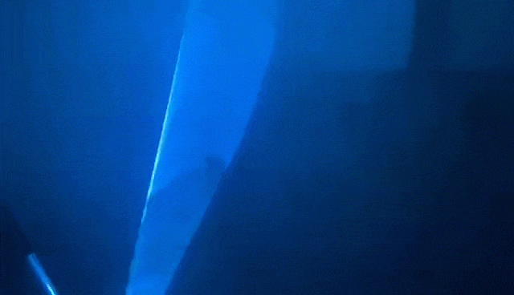

# Kinect2 和 EtherDream 交互教程

这是一个人和激光互动的案例，实现的效果非常的简单：当一定区域检测到物体的时候，激光会从一个圆形变成一个矩形。

## 概述

实现该效果的思路很简单:

- 首先使用 [Processing](https://processing.org/) 程序控制 [Kinect2](https://developer.microsoft.com/zh-cn/windows/kinect/)，Kinect2 对物体进行检测。
- 接下来当 Kinect2 检测结果出来以后，建立一个客户端向服务器发送检测的结果。用 [Nodejs](https://nodejs.org/zh-cn/) 搭建一个服务器，接受客户端传来的检测结果。
- 服务器根据结果通过 [EtherDream](https://ether-dream.com/) 去控制激光的形状。

该仓库提供了两个版本的代码，一个是[简单版本](./simple-demo/readme.md)，另一个是[完整版本](./complete-demo/readme.md)。两个版本都实现的效果都是一样的，区别主要有两点：

- 客户端代码（和 Processing 相关的代码）：简单版本只能简单识别是否有物体出现在屏幕中，完整版本可以选择检测屏幕中的某一个矩形区域，同时也提供了用户界面用于调整检测的最小深度和最大深度。
- 服务器代码（和 Nodejs 相关的代码）：完整版本代码使用了 Babel 编译器，可以使用 ES7 的语法开发，比如 `async/await`。

## 开发

在开发过程中，我们首先要确保硬件连接正确，然后安装在程序运行过程中需要的第三方库和插件，最后就可以运行代码了。

### 硬件准备

将 Kinect2 和 EtherDream 都和电脑相连接，同时 EtherDream 也和激光相连。

### 软件准备

- 安装 Processing，同时安装相关的插件：如果是 mac 电脑，安装 openkinect；如果是 windows 电脑，安装 kinectPV2
- 安装 Nodejs
- 安装 Yarn

### 运行

- 将代码克隆或者下载到本地：`git clone https://github.com/pearmini/kinect2-etherdream-demo.git`
- 运行 [simple-demo](./simple-demo/readme.md)
- 运行 [complete-demo](./complete-demo/readme.md)

